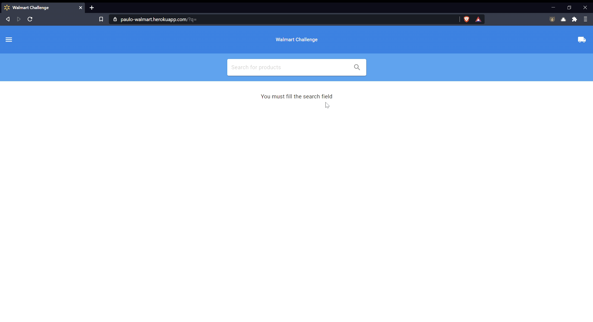

# Walmart Challenge Front end

This is the front end repo of my Walmart challenge. You can see the parent repo with docker-compose [here](https://github.com/paulomontoya/walmart-challenge)

## Technologies

- Next.js
- Typescript
- Docker
- ESLint
- Prettier

[See the back end project here](https://github.com/paulomontoya/walmart-challenge-back)

I'm hosting this with a free dyno in Heroku with Docker, so the performance is TRASH right now. But you can take a look [here](https://paulo-walmart.herokuapp.com/?q=Televi)
